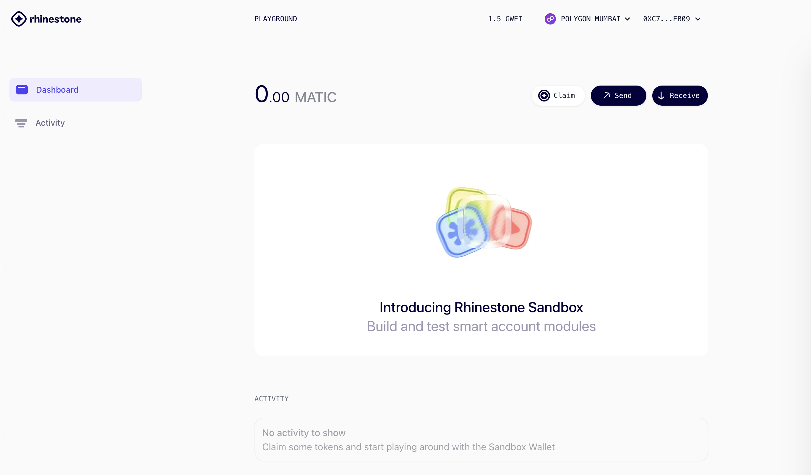

# Rhinestone Sandbox

**A frontend playground building and testing smart account modules.**

> The Sandbox is in active development and is subject to breaking changes. If you spot a bug, please take out an issue and we will fix it as soon as we can.



## Installation

```bash
yarn install
```

## Usage

1. Create a `.env` file based on the `.env.example` file
2. Run `yarn dev` to start the development server

### Custom network

To add a new network, add an entry to the `networks` object in `src/domains/Network/api/networks.ts`.

## Features

- [x] Create an ERC-7579 smart account using either an EOA or a passkey as a signer
- [x] Multi-account support and switcher
- [x] Utility functions for interacting with the smart account
- [x] Complete abstraction of ERC-4337 flows
- [x] Activity log using [Jiffyscan](https://jiffyscan.xyz/)
- [x] Faucet for testnet tokens
- [x] Support for transfering ERC-20 tokens
- [ ] Add an indexer to dynamically fetch all assets and balances
- [ ] Switch active validator

## Contributing

For feature or change requests, feel free to open a PR, start a discussion or get in touch with us.

For guidance on how to create PRs, see the [CONTRIBUTING](./CONTRIBUTING.md) guide.

## Authors ✨

<!-- ALL-CONTRIBUTORS-LIST:START - Do not remove or modify this section -->
<!-- prettier-ignore-start -->
<!-- markdownlint-disable -->
<table>
  <tr>
   <td align="center"><a href="https://twitter.com/abstractooor"><br /><sub><b>Konrad</b></sub></a><br /><a href="https://github.com/rhinestonewtf/modulekit-ui-playground/commits?author=kopy-kat" title="Code">💻</a> </td>
    <td align="center"><a href="https://github.com/YasseinBilal"><br /><sub><b>Yassin</b></sub></a><br /><a href="https://github.com/rhinestonewtf/modulekit-ui-playground/commits?author=YasseinBilal" title="Code">💻</a></td>
    
  </tr>
</table>
